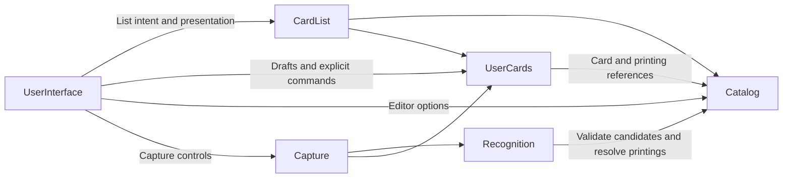

# Magic Collection Keeper high-level architecture

## Components

**ARCH-001**

Each component owns its state and decisions and exposes a public contract.

| Component     | Responsibility                                                                             |
| ------------- | ------------------------------------------------------------------------------------------ |
| Application   | Configuration, authentication integration, component assembly and application lifecycle.   |
| UserInterface | Navigation, page composition, accessible rendering, drafts and user input.                 |
| CardList      | Asynchronous list contents, enrichment, selection, working windows and restoration.        |
| Capture       | Camera lifecycle, frame admission, recognition/staging coordination and attempt feedback.  |
| Catalog       | Public identities/basic information, public search and atomic catalog synchronization.     |
| UserCards     | Private copies/tags/imports, current private queries and the rules for changing user data. |
| Recognition   | Interpretation of card images and candidate matches.                                       |

These boundaries do not imply separate deployments. Components use provider-owned contracts;
data access and changes remain subject to the owning component's rules.

Each component can be developed and tested against supplied implementations of its required
interfaces. Replacement must preserve the provided contract's data, errors, authorization,
ordering and lifecycle guarantees, not merely its method names.

## Relationships

**ARCH-002**

Application connects these components. UserInterface translates interaction into provider commands
and presents observable state. CardList and Capture are browser components with no rendering
dependency; they do not require additional services or AWS resources. UserCards includes its client
operation lifecycle as well as authoritative server operations. Business rules remain authoritative
on the backend, including when a different UI or client is used.

Catalog owns public card/printing search. UserCards owns collection/tag membership, quantities and
current private reads. Each owner evaluates complete membership, grouping and ordering before
pagination. CardList acquires one owner's list and independently loads public basics and private
fragments. Displaying ownership on a catalog result does not change its membership.

Queries mixing public catalog attributes with private membership are deferred. No consumer simulates
them by filtering loaded pages or querying another owner's tables. The [data architecture](data-architecture.md)
owns storage composition, read consistency, compatible upgrades and scaling. Initially use separate
private schemas/roles in one PostgreSQL cluster, with no copied Search database or indexing job.
A new authoritative read after a committed change includes it without waiting for background work.

Backend entry points validate identity for authenticated access. Private reads and changes use
trusted account context and remain authorized at both public and storage boundaries.

## Composition and replacement

**ARCH-003**

The composition root selects implementations and supplies their public contracts. Request handling,
page logic and business operations do not construct their dependencies. Default PostgreSQL and browser
wiring are separate from the behavior they assemble; an alternative replaces that wiring entry only.
A constructor accepting a SQL client is a storage seam, not proof that the component can be replaced.

Allowed source dependencies are:

| Consumer      | Provider contracts                                                              |
| ------------- | ------------------------------------------------------------------------------- |
| Application   | Catalog, UserCards, Recognition, CardList, Capture                              |
| UserInterface | Application's browser access; CardList, Capture, Catalog, UserCards             |
| CardList      | Catalog queries/resolution, UserCards queries/fragments; supplied account scope |
| Capture       | Recognition and UserCards; supplied account scope                               |
| Recognition   | Catalog resolution                                                              |
| UserCards     | Catalog resolution                                                              |
| Catalog       | None of the other components                                                    |

Application receives the UI factory from the browser entry point. Account scope/access is supplied
as data or a narrow capability; browser components do not import Application's composition. UI code cannot import backend
composition. Cross-component imports use public entry points, including types; dependency cycles are
rejected. Consumers use the narrow capability they need rather than recreating a provider's contract.

Replacement is checked at two boundaries: supplying an alternative implementation to a consumer,
and running the provider's behavioral contract cases against it. Providers preserve identity,
query/quantity meaning, ordering, revision/continuation, failure and authorization guarantees.
No shared SQL schema, join or connection is part of a consumer contract. Moving UserCards to a
separate database cluster changes composition and resource bindings without consumer edits.

Internal units remain within their component and share its lifecycle. Their decomposition identifies
policy, state ownership and atomic changes; it does not introduce new services or network calls.
Each component document defines those units. System flows and deployment choices remain here and in
the operations and technology documents.

## Card model

**ARCH-004**

| Level         | Meaning                                                                                                               | Owner     |
| ------------- | --------------------------------------------------------------------------------------------------------------------- | --------- |
| Card          | Playable identity, independent of a printing.                                                                         | Catalog   |
| Printing      | Published version of a card, including edition and language.                                                          | Catalog   |
| Physical copy | One particular physical card, with a stable identity, printing reference and attributes such as finish and condition. | UserCards |

A card has many printings; each physical copy references one printing. A physical copy has no
quantity field. Equivalent copies can be grouped for display and bulk actions while retaining
individual identities.

A copy's physical location is separate from its deck memberships. Decks can refer to cards,
printings or copies, and one copy can participate in several decks without changing ownership.

Catalog maintains a complete, indexed database of basic card and printing information. Reads use
this database; provider synchronization runs independently of user queries. Basic information can
be resolved in batches without waiting for live external-provider requests.

## Tags and associations

**ARCH-005**

UserCards owns two distinct concepts:

- **Tag:** a stable identity, editable name and type, such as deck, wishlist or location.
- **Association:** membership of a card, printing or physical copy in a tag. Card and printing
  associations can carry a quantity when the relationship expresses intent.

Decks, wishlists, binders and other groupings use this common organization model. Ownership uses
a system-defined owned tag associated with physical copies. Tag types define the applicable rules.

| Relationship                                        | Quantity                                                          |
| --------------------------------------------------- | ----------------------------------------------------------------- |
| Wishlist or deck associated with a card or printing | Desired or required quantity stored on the association.           |
| Deck or location associated with physical copies    | Count of associated copies. Each association identifies one copy. |
| Ownership                                           | Count of physical copies with the owned association.              |

For example, a deck can require four Lightning Bolts and contain two physical copies. Required and
physical counts remain distinct. Straightforward comparisons use card identity and printing
constraints, without stored links allocating each copy to a requirement.

A deck is a deck tag, never a location. Its card or printing quantities are independent of ownership;
a deck imported from card names needs neither printing choices nor owned copies.

UserCards supports refining or broadening an association between card and printing levels while
preserving its identity. Physical-copy membership can coexist with that intention. Views preserve
the distinction between direct associations and derived information and avoid duplicate counts.

Acquisition provenance and operation history have their own representations in UserCards.

## Import

**ARCH-006**

UserCards owns transient and saved import state, including unresolved candidates, review decisions,
pending quantities and client-side operation recovery. Recognition supplies evidence; Capture admits
eligible attempts into pending review. UserInterface presents capture and review on the Import page.

The [import lifecycle](user-cards.md#import-and-capture-state) distinguishes pending review from
accepted data. Accepting a list applies the explicitly chosen destination: deck or other tag
associations, or physical ownership. Importing or accepting a deck does not create owned copies.
Sessions group entries by
one identified import and track its progress; contents and source references describe an import
without identifying it. UserCards owns the transition and enforces visibility through its public
contracts. Recognition output alone does not establish ownership.

## Browser composition and flows

**ARCH-007**

[UserInterface](ui/architecture.md) has five modules: Navigation, Pages, CardViews, Editors and
CaptureControls. Its parent architecture owns their composition; each module document owns its
interface and responsibility. [CardList](card-list.md) and [Capture](capture.md) own the headless
behavior that screens consume. They are not UI implementation helpers.

### Browse and restore

**ARCH-008**

Navigation mounts a page. The page describes its activity and composes card views. CardList chooses
how to acquire contents from Catalog public queries, UserCards private/pending queries or its
account-local recent-activity source. It resolves public basics in batches for private references;
resolved entries carry basic information, with independent fragments following on demand. A card view renders snapshots and reports viewport and user intent.

The source owner defines complete membership, grouping and ordering; CardList owns the loaded window and
selection; CardViews owns physical rendering. Navigation retains opaque page handles, pages retain
opaque child handles, and CardList owns logical restoration. None reconstructs another owner's
state. Multiple lists retain independent context even when they describe the same cards.

### Edit and refresh

**ARCH-009**

A card view returns explicit selected-target context. An editor collects a draft and invokes the
UserCards client capability. UserCards owns operation identity, recovery and the committed outcome.
It publishes local invalidations after acknowledged or recovered commits. CardList consumes them,
marks affected private sources/fragments stale and reacquires current authoritative data. Public
membership remains unchanged when only private enrichment changes. Keep usable content while
refreshing, with explicit read failures and no speculative membership patches. Pages do not
recalculate quantities, retry pagination, poll a backend or interpret another owner's revisions.
A committed save remains successful even if a subsequent refresh fails. There is no indexing wait
or global indexing notice; ordinary list/fragment loading and error presentation remain separate.

### Capture and review

**ARCH-010**

The Import page binds capture controls to one Capture session and a pending CardList to the same
UserCards import identity. Capture owns camera work and requires affirmative geometry plus usable
identity evidence from Recognition before staging through UserCards. Only recorded acceptance
produces a success cue. UserCards protects reviewed fields from later readings. Editors send explicit
review and confirmation commands; confirmation outcomes invalidate affected pending and destination reads.

### Runtime boundaries

**ARCH-011**

Browser composition supplies account-scoped component instances. Account replacement disposes their
private mounted work, subscriptions and retained state before binding the new account. A submitted
write may finish server-side; its receipt stays with the original account. Authentication and
transport stay in Application, domain operation/recovery semantics in UserCards, loading policy in
CardList, camera workflow in Capture and presentation in UserInterface.

## Deployment composition

**ARCH-012**

The [CDK deployment design](deployment.md) defines independently deployed browser, Catalog-serving,
UserCards, Recognition and Catalog-ingestion units, plus shared foundation and gateway stacks.
Application supplies a composition entry point per runtime. Deployment boundaries do not introduce
new domain components. UserCards consumes Catalog resolution through its public service contract;
ordinary private reads remain owner-local. Compatible changes preserve consumer deployments.
[CI/CD](ci-cd.md) defines their validation and selective deployment.
