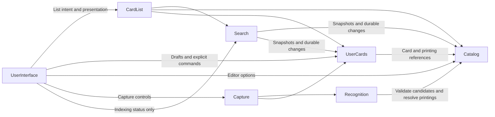

# Magic Collection Keeper high-level architecture

## Components

Each component owns its state and decisions and exposes a public contract.

| Component     | Responsibility                                                                            |
| ------------- | ----------------------------------------------------------------------------------------- |
| Application   | Configuration, authentication integration, component assembly and application lifecycle.  |
| UserInterface | Navigation, page composition, accessible rendering, drafts and user input.                |
| CardList      | Asynchronous list contents, enrichment, selection, working windows and restoration.       |
| Capture       | Camera lifecycle, frame admission, recognition/staging coordination and attempt feedback. |
| Catalog       | Public cards, printings, their relationships and the complete basic-information database. |
| UserCards     | Physical copies, tags, associations, import state and the rules for changing user data.   |
| Search        | Derived search storage, asynchronous indexing, matching, ordering and pagination.         |
| Recognition   | Interpretation of card images and candidate matches.                                      |

These boundaries do not imply separate deployments. Components use provider-owned contracts;
data access and changes remain subject to the owning component's rules.

Each component can be developed and tested against supplied implementations of its required
interfaces. Replacement must preserve the provided contract's data, errors, authorization,
ordering and lifecycle guarantees, not merely its method names.

## Relationships

Application connects these components. UserInterface translates interaction into provider commands
and presents observable state. CardList and Capture are browser components with no rendering
dependency; they do not require additional services or AWS resources. UserCards includes its client
operation lifecycle as well as authoritative server operations. Business rules remain authoritative
on the backend, including when a different UI or client is used.

Search combines public card criteria with private associations, such as cards of a particular color
that the user owns. It evaluates membership and ordering across the complete result before
pagination. Catalog and UserCards remain authoritative for their data.

Search maintains its own database of searchable facts supplied through provider-owned snapshot and
change contracts. Indexing is asynchronous: saved changes appear in query results after incorporation.
The [data architecture](data-architecture.md) owns storage separation, reliable synchronization,
rebuild and scaling. Initial deployment can use separate private schemas in one PostgreSQL cluster.

Backend entry points validate user identity for authenticated access. Private queries and changes
are authorized against trusted user context, including requests made through Search.

## Composition and replacement

The composition root selects implementations and supplies their public contracts. Request handling,
page logic and business operations do not construct their dependencies. Default PostgreSQL and browser
wiring are separate from the behavior they assemble; an alternative replaces that wiring entry only.
A constructor accepting a SQL client is a storage seam, not proof that the component can be replaced.

Allowed source dependencies are:

| Consumer      | Provider contracts                                                                               |
| ------------- | ------------------------------------------------------------------------------------------------ |
| Application   | Catalog, UserCards, Search, Recognition, CardList, Capture                                       |
| UserInterface | Application's browser access; CardList, Capture, Catalog, UserCards; Search indexing status only |
| CardList      | Catalog, UserCards and Search; supplied account scope                                            |
| Capture       | Recognition and UserCards; supplied account scope                                                |
| Recognition   | Catalog resolution                                                                               |
| UserCards     | Catalog resolution                                                                               |
| Search        | Catalog and UserCards snapshot/change publications                                               |
| Catalog       | None of the other components                                                                     |

Application receives the UI factory from the browser entry point. Account scope/access is supplied
as data or a narrow capability; browser components do not import Application's composition. UI code cannot import backend
composition. Cross-component imports use public entry points, including types; dependency cycles are
rejected. Consumers use the narrow capability they need rather than recreating a provider's contract.

Replacement is checked at two boundaries: supplying a different implementation to a consumer, and
running the provider's behavioral contract tests against that implementation. Replacing Catalog or
UserCards preserves published facts, revisions, snapshot/change continuity and account isolation.
Search's projection storage is independent of their databases. Replacing Search preserves query,
pagination and freshness semantics without requiring its consumers to know its storage layout.

Internal units remain within their component and share its lifecycle. Their decomposition identifies
policy, state ownership and atomic changes; it does not introduce new services or network calls.
Each component document defines those units. System flows and deployment choices remain here and in
the operations and technology documents.

## Card model

| Level         | Meaning                                                                                                               | Owner     |
| ------------- | --------------------------------------------------------------------------------------------------------------------- | --------- |
| Card          | Playable identity, independent of a printing.                                                                         | Catalog   |
| Printing      | Published version of a card, including edition and language.                                                          | Catalog   |
| Physical copy | One particular physical card, with a stable identity, printing reference and attributes such as finish and condition. | UserCards |

A card has many printings; each physical copy references one printing. A physical copy has no
quantity field. Equivalent copies can be grouped for display and bulk actions while retaining
individual identities.

A copy has at most one physical location. Planned decks refer independently to cards or printings.

Catalog maintains a complete, indexed database of basic card and printing information. Reads use
this database; provider synchronization runs independently of user queries. Basic information can
be resolved in batches without waiting for live external-provider requests.

## Tags and associations

UserCards owns two distinct concepts:

- **Tag:** a stable identity, editable name and type, such as deck, wishlist or location.
- **Association:** membership of a card, printing or physical copy in a tag. Card and printing
  associations can carry a quantity when the relationship expresses intent.

Decks, wishlists, binders and other groupings use this common organization model. Ownership uses
a system-defined owned tag associated with physical copies. Tag types define the applicable rules.

| Relationship                                        | Quantity                                                          |
| --------------------------------------------------- | ----------------------------------------------------------------- |
| Wishlist or deck associated with a card or printing | Desired or required quantity stored on the association.           |
| Deck or location associated with physical copies    | Count of associated copies. Each association identifies one copy. |
| Ownership                                           | Count of physical copies with the owned association.              |

For example, a deck can require four Lightning Bolts and contain two physical copies. Required and
physical counts remain distinct. Straightforward comparisons use card identity and printing
constraints, without stored links allocating each copy to a requirement.

UserCards supports refining or broadening an association between card and printing levels while
preserving its identity. Physical-copy membership can coexist with that intention. Views preserve
the distinction between direct associations and derived information and avoid duplicate counts.

Acquisition provenance and operation history have their own representations in UserCards.

## Import

UserCards owns transient and saved import state, including unresolved candidates, review decisions,
pending quantities and client-side operation recovery. Recognition supplies evidence; Capture admits
eligible attempts into pending review. UserInterface presents capture and review on the Import page.

The [import lifecycle](user-cards.md#import-and-capture-state) uses system tags to distinguish
pending entries, visible only on Import, from confirmed owned copies. Sessions group entries by
one identified import and track its progress; contents and source references describe an import
without identifying it. UserCards owns the transition and enforces visibility through its public
contracts. Recognition output alone does not establish ownership.

## Browser composition and flows

[UserInterface](ui/architecture.md) has five modules: Navigation, Pages, CardViews, Editors and
CaptureControls. Its parent architecture owns their composition; each module document owns its
interface and responsibility. [CardList](card-list.md) and [Capture](capture.md) own the headless
behavior that screens consume. They are not UI implementation helpers.

### Browse and restore

Navigation mounts a page. The page describes its activity and composes card views. CardList chooses
how to acquire the contents, using Search for queries, UserCards for pending entries and its own
account-local recent-activity source. Basic information arrives with resolved entries; independent
fragments follow on demand. A card view renders snapshots and reports viewport and user intent.

Search owns complete membership, grouping and ordering; CardList owns the loaded window and
selection; CardViews owns physical rendering. Navigation retains opaque page handles, pages retain
opaque child handles, and CardList owns logical restoration. None reconstructs another owner's
state. Multiple lists retain independent context even when they describe the same cards.

### Edit and refresh

A card view returns explicit selected-target context. An editor collects a draft and invokes the
UserCards client capability. UserCards owns operation identity, recovery and the committed outcome.
It publishes local change invalidations after known commits. CardList consumes these and reacquires
affected contents or fragments. Query-visible changes carry their publication position, allowing
CardList to await Search incorporation before treating refreshed results as caught up. Pages do not
patch rows, recalculate quantities or retry pagination. Local invalidation requests presentation
refresh; durable provider publication independently maintains the search database.

Application forwards committed positions to Search's browser progress capability. Navigation's shell
presents its account-scoped status as a floating indexing notice across page changes. The notice
reports indexing progress separately from the editor's saved outcome; it disappears on incorporation
and exposes delayed/failed status without retrying the write.

### Capture and review

The Import page binds capture controls to one Capture session and a pending CardList to the same
UserCards import identity. Capture owns camera work and requires affirmative geometry plus usable
identity evidence from Recognition before staging through UserCards. Only recorded acceptance
produces a success cue. UserCards protects reviewed fields from later readings. Editors send explicit
review and confirmation commands; confirmation outcomes invalidate affected pending/owned reads.

### Runtime boundaries

Browser composition supplies account-scoped component instances. Account replacement disposes their
private mounted work, subscriptions and retained state before binding the new account. A submitted
write may finish server-side; its receipt stays with the original account. Authentication and
transport stay in Application, domain operation/recovery semantics in UserCards, loading policy in
CardList, camera workflow in Capture and presentation in UserInterface.
