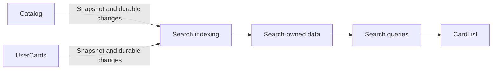

# Data architecture

## Storage ownership

Separate authoritative records from rebuildable search data. Each component owns its schema,
storage access and migrations. Sharing a database deployment does not grant cross-component access.

| Owner     | Stored data                                                                                          | Authority                                             |
| --------- | ---------------------------------------------------------------------------------------------------- | ----------------------------------------------------- |
| Catalog   | Cards, names, printings, catalog revisions and publication state.                                    | Public card facts.                                    |
| UserCards | Copies, tags, associations, imports, receipts, provenance and publication state.                     | Private user records and committed changes.           |
| Search    | Searchable catalog facts, account-scoped copy/association facts, indexes and processing checkpoints. | Derived query results at a declared indexed revision. |

Search owns a separate logical database. Initially, use private schemas/tables in the same Aurora
PostgreSQL deployment. Search queries its own data; it does not join Catalog or UserCards tables or
views. SQL schemas, indexes and connections remain implementation details of their owner.

The [Catalog publication contract](catalog.md#query-surface) and
[UserCards publication contract](user-cards.md#query-surface) own the facts made available to Search.
[Search](search.md) owns their projection and query semantics. This document owns the storage
composition and synchronization strategy, not a shared domain model or shared event schema.

## Asynchronous synchronization

A successful domain write commits to its owner's storage. Search visibility follows when indexing
applies the corresponding publication. Process incremental changes continuously through background
work; an ordinary edit does not require a full reindex. Indexing is part of Search and is independent
of browser requests and open pages.

Use a transactional outbox in each authoritative relational store: commit the domain change and its
durable publication together. The provider exposes committed publications through its own interface.
Consumers do not read its outbox table. This publication is distinct from best-effort browser
invalidation hints, which cannot maintain a durable search database.

Delivery may repeat or resume after interruption. Search applies published identities/revisions
idempotently, rejects obsolete updates and persists its checkpoint with the corresponding projection
change. Deletes are published explicitly. A failed batch cannot advance a checkpoint past unapplied
changes. Publish each logically atomic change completely so queries cannot observe half a confirmation
or location move. Domain writes remain available when indexing is delayed.

## Bootstrap and rebuild

Each provider supplies a consistent, bounded snapshot with a position from which changes can be
resumed without a gap. Catalog scope is a published catalog revision; private scope is an account.
Keep revisions and progress separate for each source and private account. No global ordering across
independent providers is required.

Search builds a replacement generation, catches up changes and validates it before making it
queryable. Continue serving the previous complete generation during rebuild. Initial indexing with
no usable generation is unavailable/updating, never a successful empty collection. An expired change
position requires a new snapshot; partial rebuilds and silent skipped changes are not valid recovery.

The index is disposable; authoritative records, receipts and provenance are not. Rebuilding Search
never creates copies, replays ownership commands or changes import state.

## Freshness and user-visible behavior

Saving and indexing are separate outcomes. A committed operation remains successful while its change
awaits indexing. Direct record and pending-import reads continue through UserCards; query-based lists
reflect the last completely indexed state.

[Search's freshness contract](search.md#freshness) exposes indexing progress relative to a known
committed change. CardList uses that contract to present an updating list and reacquire results when
ready. Existing usable results can remain visible while updating. An index delay must not become a
failed save, another write attempt or an apparent empty result. UI does not insert speculative rows
to imitate search membership. Pagination and counts refer to the returned index generation.

No numeric indexing-delay guarantee is selected. Measure normal lag, catch-up after interruption
and bulk-import lag before setting an operational target.

## Access and deployment

Use separate component storage roles. Search's query role can read its projection only; its indexing
role can maintain that projection. Neither receives authority to query or write another component's
tables. Application assembles trusted publication access and job entry points. An indexing worker's
service access is separate from end-user query authorization.

Account identity is part of every private publication, projection key and query context. Enforce it
at the Search storage boundary as well as its public interface. Indexing is not an authorization
cache: validate access on every query. Propagate deletions and never publish pending-import records
into ordinary searchable ownership data.

## Scale

Keep shared card facts once per search storage partition; private copies reference their card and
printing identities. Avoid duplicating names, rules text and images for every user's copy. Preserve
copy-level attributes and associations needed for correct filters; aggregates cannot replace those
facts when a query requires individual identities.

Index private access by account and the supported query patterns. Ordinary collection queries and
private publication checkpoints stay account-scoped. Changes by one account must not invalidate
another account's continuation. Load and update bounded batches without imposing a total collection
or quantity limit.

Account-based sharding is a growth path behind the storage interface. Many accounts can share a
shard, with shared catalog facts available locally for combined queries. Introduce sharding or read
replicas based on measured capacity needs; neither changes the public component contracts.

Use 100,000 accounts with 10,000 copies each (one billion copies) as a scale evaluation scenario,
not a capacity claim or product ceiling. Include association/index storage, concurrent searches,
bulk imports, indexing backlog and rebuild time. Registered-user count alone does not size compute.

## Pattern references

- [Materialized read models](https://learn.microsoft.com/en-us/azure/architecture/patterns/materialized-view): derived, rebuildable query data.
- [Transactional outbox](https://docs.aws.amazon.com/prescriptive-guidance/latest/cloud-design-patterns/transactional-outbox.html): durable publication coupled to a committed write.
- [Sharding](https://learn.microsoft.com/en-us/azure/architecture/patterns/sharding): account-based distribution behind storage access.
