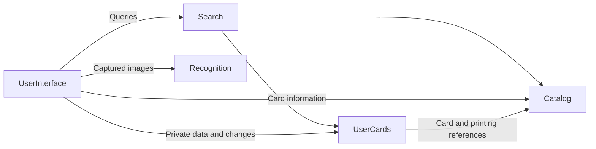

# Magic Collection Keeper high-level architecture

## Components

Keeper has six logical components. Each owns its state and decisions and exposes a public contract.

| Component | Responsibility |
| --- | --- |
| Application | Configuration, authentication integration, component assembly and application lifecycle. |
| UserInterface | Pages, navigation, device interaction, card lists and tools. |
| Catalog | Public cards, printings, their relationships and the complete basic-information database. |
| UserCards | Physical copies, tags, associations, import state and the rules for changing user data. |
| Search | Queries across Catalog and UserCards, including matching, ordering and pagination. |
| Recognition | Interpretation of card images and candidate matches. |

These boundaries do not imply separate deployments. Components use provider-owned contracts;
data access and changes remain subject to the owning component's rules.

## Relationships



Application connects these components. UserInterface coordinates user interaction; each component
owns its operations and business rules.

Search combines public card criteria with private associations, such as cards of a particular color
that the user owns. It evaluates membership and ordering across the complete result before
pagination. Catalog and UserCards remain authoritative for their data.

Backend entry points validate user identity for authenticated access. Private queries and changes
are authorized against trusted user context, including requests made through Search.

## Card model

| Level | Meaning | Owner |
| --- | --- | --- |
| Card | Playable identity, independent of a printing. | Catalog |
| Printing | Published version of a card, including edition and language. | Catalog |
| Physical copy | One particular physical card, with a stable identity, printing reference and attributes such as finish and condition. | UserCards |

A card has many printings; each physical copy references one printing. A physical copy has no
quantity field. Equivalent copies can be grouped for display and bulk actions while retaining
individual identities.

Catalog maintains a complete, indexed database of basic card and printing information. Reads use
this database; provider synchronization runs independently of user queries. Basic information can
be resolved in batches without waiting for live external-provider requests.

## Tags and associations

UserCards owns two distinct concepts:

- **Tag:** a stable identity, editable name and type, such as deck, wishlist or location.
- **Association:** membership of a card, printing or physical copy in a tag. Card and printing
  associations can carry a quantity when the relationship expresses intent.

Decks, wishlists, binders and other groupings use this common organization model. Ownership uses
a system-defined owned tag associated with physical copies. Tag types define the applicable rules.

| Relationship | Quantity |
| --- | --- |
| Wishlist or deck associated with a card or printing | Desired or required quantity stored on the association. |
| Deck or location associated with physical copies | Count of associated copies. Each association identifies one copy. |
| Ownership | Count of physical copies with the owned association. |

For example, a deck can require four Lightning Bolts and contain two physical copies. Required and
physical counts remain distinct. Straightforward comparisons use card identity and printing
constraints, without stored links allocating each copy to a requirement.

UserCards supports refining or broadening an association between card and printing levels while
preserving its identity. Physical-copy membership can coexist with that intention. Views preserve
the distinction between direct associations and derived information and avoid duplicate counts.

Acquisition provenance and operation history have their own representations in UserCards.

## Import

UserCards owns transient and saved import state, including unresolved candidates, review decisions
and pending quantities. System tags organize pending entries. Recognition supplies candidates;
UserInterface provides capture and review through the Import page.

Pending entries are distinct from owned copies. Explicit confirmation of a quantity creates the
corresponding individual physical-copy records and preserves provenance. Recognition output alone
does not establish ownership.

## UserInterface

```text
UserInterface
├── Pages
│   ├── Home
│   ├── Catalog and search
│   ├── Collection
│   ├── Tags and organization
│   ├── Tag view: deck, wishlist, location or other grouping
│   ├── Card details
│   └── Import: manual entry, scanning and source imports
├── Navigation
└── Shared components
    ├── CardList
    └── Card tools
```

Pages compose card lists and tools around an activity. Navigation restores the relevant page
context. UserInterface owns presentation and interaction state such as focus, selection and scroll.

### CardList

CardList presents and supports interaction with a set of entries at any card level. Search results,
sets, collection views, decks, wishlists, locations, pending imports and recent cards use it.

| Part | Responsibility |
| --- | --- |
| Source | Entries, membership, ordering, context and access to further results. |
| CardList | Asynchronous loading and list interaction state. |
| Presentation | Layout and rendering, including grouping physical copies. |
| Tools | User actions through the responsible component's operations. |

Search supplies query results; UserCards supplies pending entries; UserInterface supplies recent
card activity. Sources preserve the meaning of their entries and quantities. Stable entry identity
allows refinement and enrichment without losing interaction context.

A page can contain multiple independent CardLists. Each retains its own query, loading state,
selection and scroll.

Resolved entries arrive with basic card information. Images, ownership, tags and tool availability
load and refresh independently on demand. Data access is batched where appropriate. A fragment's
failure or refresh preserves the other information and the user's interaction state.

Sources provide bounded results; CardList loads and renders a bounded working set. Loading and
failure remain distinguishable from an empty result. Responses to obsolete queries, routes or user
sessions cannot replace current state.
