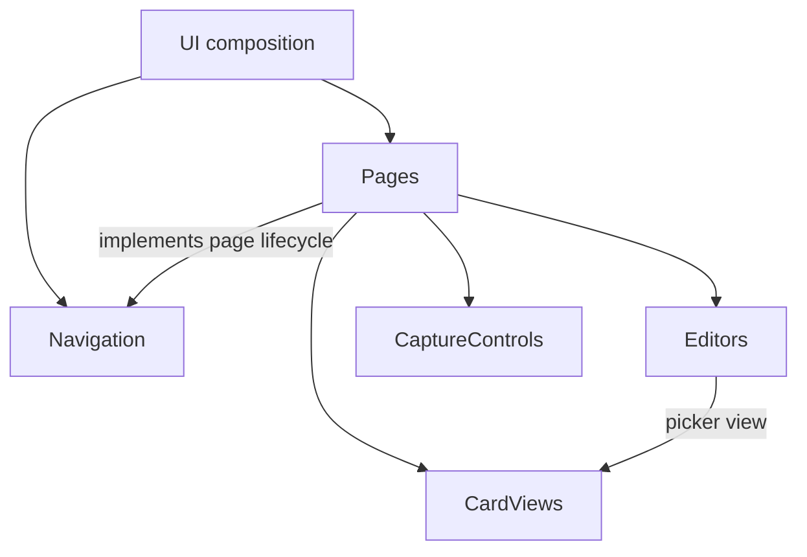

# UserInterface

## Responsibility

Turn application state into accessible screens and user input into explicit commands. Own visual
composition and presentation state. Data acquisition, list behavior, capture admission and business
operations have separate owners.

## Interface

- Receive account access, public settings and ready capabilities from [Application](../application.md).
  Provide a mount/dispose lifecycle; request sign-in and sign-out through the supplied account access.
- Present and control [CardList](../card-list.md) instances. Pass a list description, user intent and
  viewport observations; consume observable presentation snapshots and opaque retained state.
- Present [Capture](../capture.md) state and forward start, stop and retry commands.
- Observe [Search](../search.md#freshness)'s account-scoped indexing status for the shell notice.
  This capability exposes progress only; list queries remain behind CardList.
- Edit through [UserCards](../user-cards.md)'s public reads, commands and recoverable operation handles.
  Use [Catalog](../catalog.md) lookup for editor options. Providers own validation and committed state.
- Each module below owns its public interface. Constructors receive narrow capabilities; neither
  pages nor renderers select concrete implementations, transports or persistence.

## Modules and composition

| Module                                 | Owns                                                                             | Does not own                                                                |
| -------------------------------------- | -------------------------------------------------------------------------------- | --------------------------------------------------------------------------- |
| [Navigation](navigation.md)            | Routes, shell, page lifetime and opaque history retention.                       | Page data, list state, authentication policy.                               |
| [Pages](pages.md)                      | Activity layout, route context and composition of mounted views.                 | Loading card contents, interpreting operation receipts, capture sequencing. |
| [CardViews](card-views.md)             | Visible card/list rendering, viewport measurement and input translation.         | Selection rules, membership, pagination, enrichment or caching.             |
| [Editors](editors.md)                  | Unsaved fields, action controls, validation feedback and operation presentation. | Business validation, import identity, replay, ownership or location rules.  |
| [CaptureControls](capture-controls.md) | Camera preview, controls and accessible feedback.                                | Devices, geometry decisions, inference or staging.                          |

These are replaceable modules within one browser application, not separate deployments. Ordinary
buttons, field controls, typography and layout styles are shared presentation code, not another
workflow component. Keep activity-specific editors and page factories separate behind their module's
entry point; a single page closure must not implement all their responsibilities.

The UI composition root registers page factories with Navigation. Navigation owns the page lifecycle
contract; Pages implements it. Pages composes CardViews, Editors and CaptureControls. Editors can
request a supplied CardViews factory for a card/printing picker. The remaining modules do not import
Pages or Navigation. User intents leaving a child view are translated into routes by its page.

Only composition imports concrete module factories. Other imports, including types, go through the
provider's public entry point. Avoid a shared mutable screen store, global event bus or generic
workflow engine. A child view exposes its state and intent through its own contract.

## State ownership and restoration

| Module          | Owned state                                          | Delegated state                                           |
| --------------- | ---------------------------------------------------- | --------------------------------------------------------- |
| Navigation      | Route and history entry lifetime.                    | Opaque page retention handle; supplied account access.    |
| Pages           | Layout and active section.                           | Child view handles and resource references.               |
| CardViews       | Mounted DOM, measurements and physical scroll/focus. | List snapshots, selection and opaque retained list state. |
| Editors         | Unsaved draft and its base revision.                 | Authoritative values and operation handles.               |
| CaptureControls | Mounted preview and displayed feedback.              | Device/session status and identified attempt events.      |

The retain/restore/release chain follows composition. Navigation never decodes page state; Pages
never decodes list state. Closing a mounted page disposes its views and subscriptions. Retained
history is separate from mounted resources: it keeps no camera, DOM or active request alive.
Evicting history releases retained handles. Each owner bounds its own resources without imposing
new product limits on another owner's state.

## Asynchronous presentation

Render the shell and page structure before remote work completes. Mount independent regions
without a page-wide barrier. Known basic card information can render immediately; optional images,
counts, tags and actions have independent pending, ready, absent and failed states.

Each mounted view has a lifetime. Disposed views unsubscribe, and late callbacks cannot update a
replacement view or account. Cancellation of presentation work never asserts that a submitted write
was rolled back. Reopening observes the provider's recorded outcome.

Editors keep drafts when background data changes. They show conflicts and let the user reconcile;
background refresh cannot overwrite input. A successful command is displayed only after its provider
reports commitment. A list receives invalidation through its data capabilities, not page code that
patches rows or restarts pagination.

## Load time and rendering

Load only the active page and its needed capabilities. Preparing camera models is outside normal
browsing startup. Keep the initial shell small, render a bounded visible window and request optional
information according to visible demand. Avoid serial reads per row and repeated work on every
render. Delegate data reuse and request scheduling to the list capability; rendering must not create
another cache.

Measure time to usable basic content separately from image/enrichment completion, including cold
startup and navigation restoration. Add caching, prefetching or background workers only for an
observed need. UI responsiveness must not depend on every fragment succeeding.

## Interaction rules

Use dedicated pages for navigable activities; reserve dialogs for brief confirmations and small
auxiliary actions. Support keyboard and touch, clear loading/error states, focus restoration and
safe rendering of external text. Keep owned, intended and physical-location counts visibly distinct.
Never label parsing, recognition or an unresolved write as confirmed ownership.

Navigation owns the floating [indexing notice](navigation.md#indexing-notice). It remains visible
across page changes while saved changes are being incorporated, independently of local form feedback.

Use the same floating presentation for [error notices](navigation.md#error-notices), with red styling
and a clear message. Field and row validation remains next to the affected input.

## Replacement check

Replacing a module requires changing its construction only. Its consumers keep their code and
receive the same state, intent and lifecycle behavior. Verify each module through its public
contract, then exercise the composed browser journeys described in [Testing](../testing.md).
Test list and capture behavior at their own boundaries; UI tests verify their presentation.
