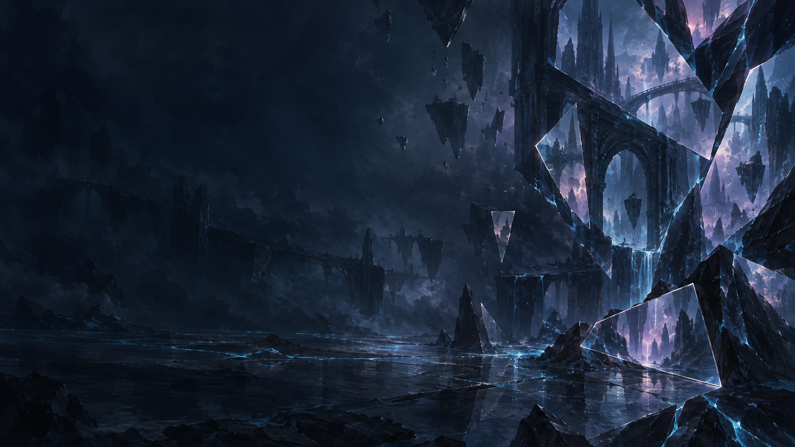

# Fracture atmosphere

Generated with the built-in image generation tool for this project. This original asset is a local
showcase background, not copied Magic artwork. Use it as subdued hero or outer-canvas atmosphere,
with readable foreground surfaces. The implementation can copy it into the local workspace assets;
do not include it in production packaging in this iteration.

## Generation prompt

Use case: stylized-concept. Asset type: original atmospheric background texture for a local Magic collection keeper design-language showcase. Create a wide 16:9 painterly fantasy material study inspired by fractured alternate realities: deep midnight navy and blue-black stone, suspended mirror-glass facets, luminous icy cyan veins and fine lavender-magenta reflected light, a few pale silver edges. Angular shards reveal subtly displaced fragments of a monumental abstract arcane architecture, like reality reflected through cracked glass. Sophisticated, tactile, softly brushed, dark and quiet rather than a neon sci-fi dashboard. Most of the image should stay low contrast and dark; preserve generous calm negative space across the left half and center for readable overlaid UI text. Concentrate the sharpest illuminated facets toward the right edge, with gentle luminous depth, no glaring white focal point. This is a background, not a full UI mockup. Original composition; do not reproduce existing set artwork, recognizable characters, Magic logos, card frames, symbols, readable glyphs or lettering. No text, no logos, no watermark, no interface, no buttons. A restrained cinematic atmospheric texture, clean enough to sit behind an elegant editorial heading.
